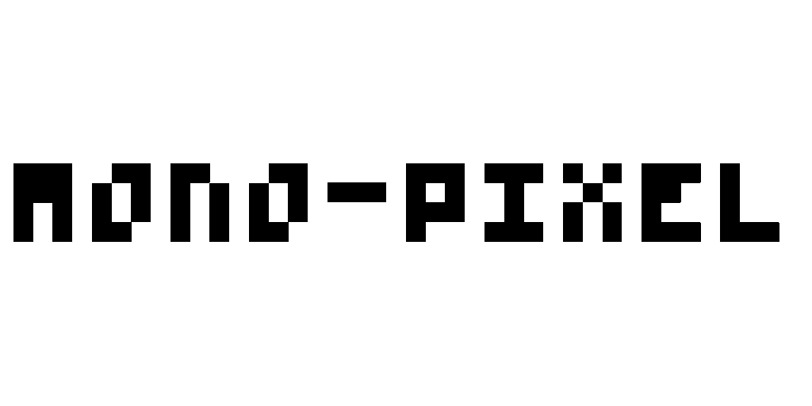

mono-pixel is a small Python library and CLI for rendering "pixel"-style text
images. Use any font you want.


# Quick start

## Installation

**Install directly (uvx / pipx)** — no clone required:

```bash
# via uvx (uv's transient runner)
uvx mono-pixel --help

# via pipx (isolated user install)
pipx install mono-pixel
```

**From source (clone)**:

```bash
# clone the repo
git clone https://github.com/czy014/mono-pixel.git
cd mono-pixel

# install with uv
uv sync
uv run mono-pixel --help

# or install globally with pip
pip install .
mono-pixel --help
```

## Usage

```bash
# just use
mono-pixel run
```

It will initiate an interactive mode to guide you through passing in some necessary parameters.

If you need a pure command-line, please refer to [Usage](docs/usage.md).


**Below are some fonts displayed in the terminal ASCII preview compared to the actual generated images.**


```
+--------------------------------------------------------------------------------+
|                                                                                |
|                                                                                |
|                                                                                |
|                                                                                |
|                                                                                |
| ***************************************************************************    |
| *@@@@@@@@@   @@@@@@@@@@      @@@@@@@      @@@@@@@                @@@@@@@@@*    |
| *@@@@@@@@@   @@@@@@@@@@      @@@@@@@      @@@@@@@                @@@@@@@@@*    |
| *@@@   @@@      @@@@      @@@          @@@   @@@@                @@@   @@@*    |
| *@@@@@@@@@      @@@@      @@@          @@@   @@@@   @@@@@@@@@@   @@@@@@@@@*    |
| *@@@@@@@@@      @@@@      @@@          @@@   @@@@   @@@@@@@@@@   @@@@@@@@@*    |
| *@@@            @@@@      @@@          @@@   @@@@                @@@   @@@*    |
| *@@@         @@@@@@@@@@      @@@@@@@   @@@@@@                    @@@@@@@@@*    |
| ***************************************************************************    |
|                                                                                |
|                                                                                |
|                                                                                |
|                                                                                |
|                                                                                |
|                                                                                |
+--------------------------------------------------------------------------------+
```


```
+--------------------------------------------------------------------------------+
|                                                                                |
| ***************************************************************************    |
| *                                           @@@        @@@   @@@        @@*    |
| *                                           @@@        @@@   @@@        @@*    |
| *                   @@                                 @@@   @@@        @@*    |
| *                                                      @@@              @@*    |
| *                                                      @@@              @@*    |
| *                                                      @@@              @@*    |
| *@@@@@@@@@@      @@@@@      @@@        @@@     @@@@@@@@              @@@  *    |
| *@@        @@@      @@         @@   @@@                @@@         @@     *    |
| *@@        @@@      @@         @@   @@@                @@@         @@     *    |
| *@@        @@@      @@           @@@                   @@@      @@@       *    |
| *@@        @@@      @@           @@@                   @@@   @@@          *    |
| *@@@@@@@@@@         @@         @@   @@@     @@@        @@@   @@@          *    |
| *@@@@@@@@@@         @@         @@   @@@     @@@        @@@   @@@          *    |
| *@@              @@@@@@@@   @@@        @@@     @@@@@@@@      @@@@@@@@@@@@@*    |
| *@@                                                                       *    |
| *@@                                                                       *    |
| ***************************************************************************    |
|                                                                                |
+--------------------------------------------------------------------------------+
```

License
This project is available under the terms described in the `LICENSE.txt` file.

